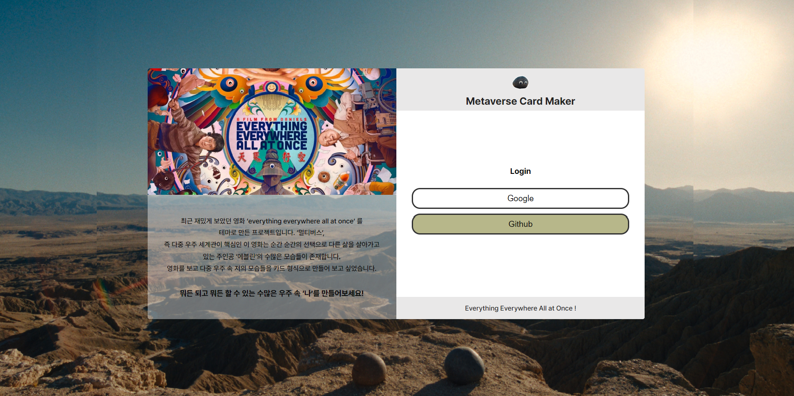
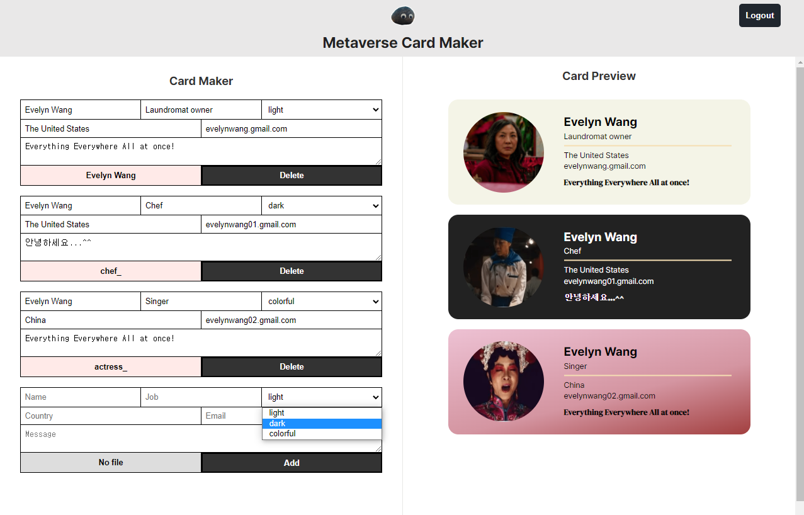

# Card Maker [](https://rococo-lamington-8b84b3.netlify.app/)

> A curated list of gentle-monster READMEs

<br>

## 👀 프로젝트 소개

최근 재밌게 보았던 영화 ‘everything everywhere all at once’ 를
테마로 만든 프로젝트입니다. ‘멀티버스’,
즉 다중 우주 세계관이 핵심인 이 영화는 순간 순간의 선택으로 다른 삶을 살아가고 있는 주인공 ‘에블린’의 수많은 모습들이 존재합니다.
영화를 보고 다중 우주 속 저의 모습들을 카드 형식으로 만들어 보고 싶어 만들어 본 Metaverse Card Maker 프로젝트입니다. (포트폴리오용으로 제작되었습니다.)

🔗 [배포 링크](https://rococo-lamington-8b84b3.netlify.app/)

<br>

## 📍 주요 기능

#### 1. 로그인



- firebase를 사용해 로그인 기능을 구현하였습니다.
  ```jsx
  login(providerName) {
    const authProvider = this.getProvider(providerName);
    return firebaseAuth.signInWithPopup(authProvider);
  }
  ```

<br>

#### 2. 카드 실시간 편집, 미리보기



- firebase 실시간 데이터베이스에서 **userId**에 카드의 정보를 저장하여 관리하였습니다.

  ```jsx
  saveCard(userId, card) {
    firebaseDatabase.ref(`${userId}/cards/${card.id}`).set(card);
  }
  ```
<br>

- input의 value가 변경되면 `updateCard()` 함수로 value를 전달하여 실시간 데이터베이스에 반영하고 그 정보를 받아와 Preview 컴포넌트에서 실시간으로 볼 수 있게 구현하였습니다.

  ```jsx
  updateCard({
    ...card,
    [event.currentTarget.name]: event.currentTarget.value,
  });
  ```
<br>

- 등록된 카드의 정보는 **firebase**와 **cloudinary**에서 수정, 관리가 가능하도록 하였습니다.

<br>
